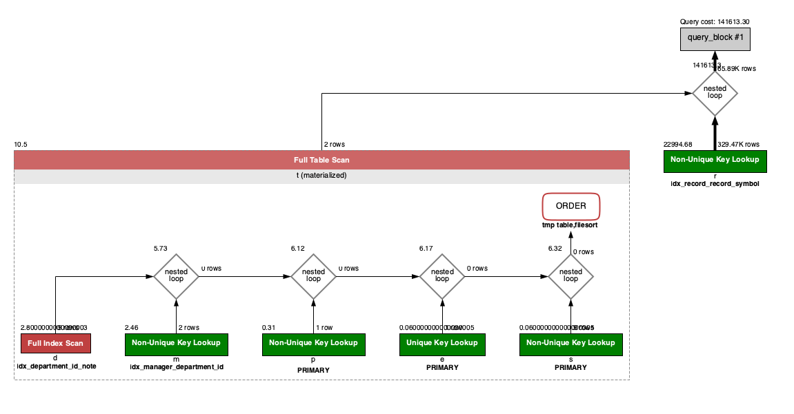
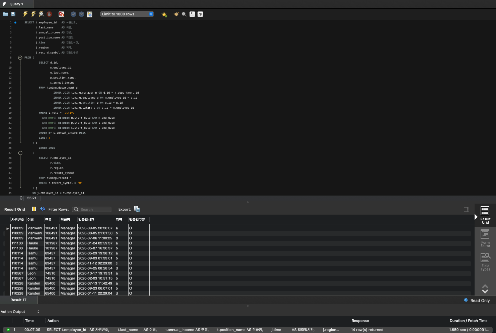

<p align="center">
    
</p>
<p align="center">
  
  
  <a href="https://edu.nextstep.camp/c/R89PYi5H" alt="nextstep atdd">
    
  </a>
  
</p>

<br>

# 인프라공방 샘플 서비스 - 지하철 노선도

<br>

## 🚀 Getting Started

### Install

#### npm 설치

```
cd frontend
npm install
```

> `frontend` 디렉토리에서 수행해야 합니다.

### Usage

#### webpack server 구동

```
npm run dev
```

#### application 구동

```
./gradlew clean build
```

<br>

## 미션

* 미션 진행 후에 아래 질문의 답을 작성하여 PR을 보내주세요.

### 1단계 - 쿼리 최적화

1. 인덱스 설정을 추가하지 않고 아래 요구사항에 대해 1s 이하(M1의 경우 2s)로 반환하도록 쿼리를 작성하세요.

- 활동중인(Active) 부서의 현재 부서관리자 중 연봉 상위 5위안에 드는 사람들이 최근에 각 지역별로 언제 퇴실했는지 조회해보세요. (사원번호, 이름, 연봉, 직급명, 지역,
  입출입구분, 입출입시간)

**Environment**

- "M1 MacBook Pro"
- "MySQL Workbench"

**SQL DML**

``` sql
SELECT t.employee_id   AS 사원번호,
       t.last_name     AS 이름,
       t.annual_income AS 연봉,
       t.position_name AS 직급명,
       j.time          AS 입출입시간,
       j.region        AS 지역,
       j.record_symbol AS 입출입구분
FROM (
         SELECT d.id,
                m.employee_id,
                e.last_name,
                p.position_name,
                s.annual_income
         FROM tuning.department d
                  INNER JOIN tuning.manager m ON d.id = m.department_id
                  INNER JOIN tuning.employee e ON m.employee_id = e.id
                  INNER JOIN tuning.position p ON e.id = p.id
                  INNER JOIN tuning.salary s ON s.id = m.employee_id
         WHERE d.note = 'active'
           AND NOW() BETWEEN m.start_date AND m.end_date
           AND NOW() BETWEEN p.start_date AND p.end_date
           AND NOW() BETWEEN s.start_date AND s.end_date
         ORDER BY s.annual_income DESC
         LIMIT 5
     ) t
         INNER JOIN
     (
         SELECT r.employee_id,
                r.time,
                r.region,
                r.record_symbol
         FROM tuning.record r
         WHERE r.record_symbol = 'O'
     ) j
     ON j.employee_id = t.employee_id;
```

**SQL Execution Explain**  

**SQL Query Results**


---

### 2단계 - 인덱스 설계

1. 인덱스 적용해보기 실습을 진행해본 과정을 공유해주세요

---

### 추가 미션

1. 페이징 쿼리를 적용한 API endpoint를 알려주세요
